# Table of Contents
## I. Record of Changes	
## II. Software Requirement Specification
### 1. Product Overview	
The Korean teaching management system is solution to meet with learning, judging and payment of students and teachers. The system is expected to evolve only web application releases, ultimately connecting to the Internet in order to interact between students, teachers and admins.
### 2. User Requirements	
#### 2.1 Actors	
| #  | Actor        | Description                                                                                                                                                   |
|----|--------------|---------------------------------------------------------------------------------------------------------------------------------------------------------------|
| 1  | Guess        | Guesses are users who have not logged in. They can view website courses and overview courses.                                                                  |
| 2  | Students     | Students are users who have logged in. They can logout, choose courses, view an overview of all courses, watch videos, and do exercises in courses they bought. |
| 3  | Administrator| They are responsible for managing and operating the platform. Administrators manage videos, user accounts, and fees. They can also view all students in each course. |

#### 2.2 Use Cases	
##### 2.2.1 Diagram(s)	
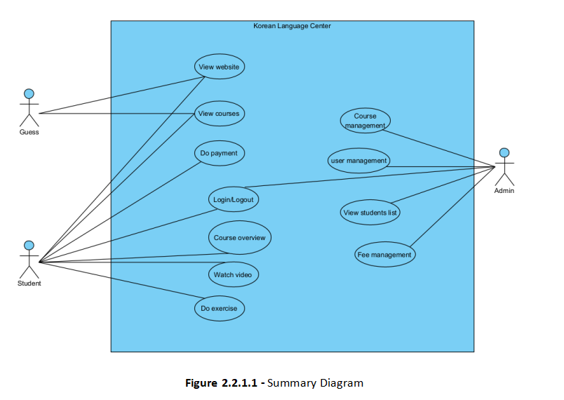
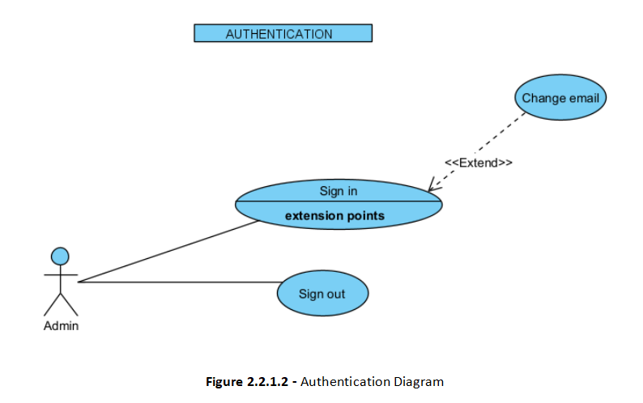
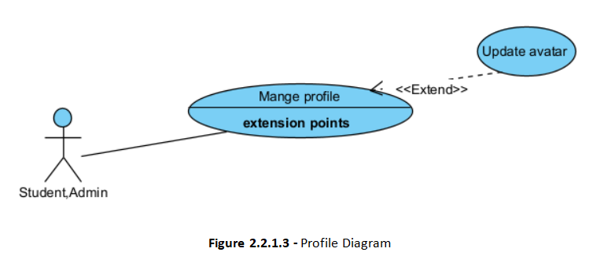
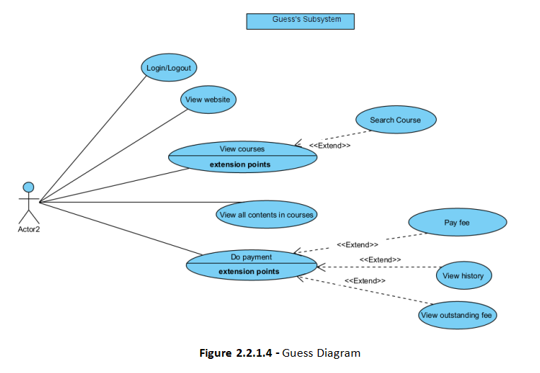
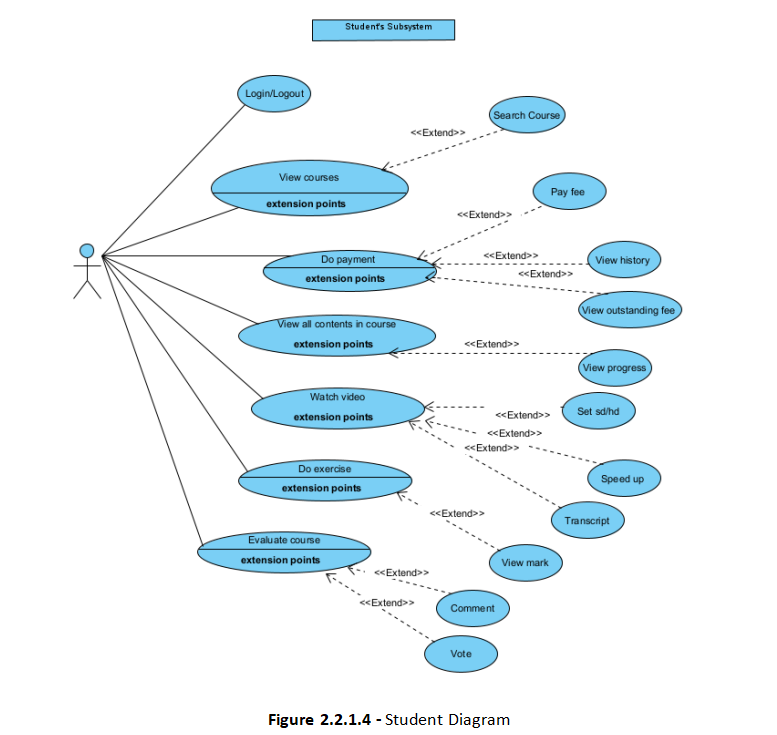
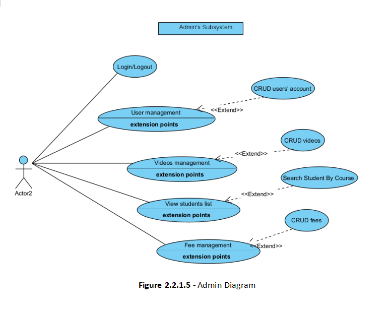
##### 2.2.2 Description	
| Use Case                | Actors                        | Use Case Description                                                                                       |
|-------------------------|-------------------------------|------------------------------------------------------------------------------------------------------------|
| View website            | Guess, Student, Admin         | The actor can view the website                                                                             |
| View courses            | Guess, Student, Admin         | The actor can view all courses on the website                                                              |
| Search courses          | Guess, Student, Admin         | The actor can search to find courses by the course’s name                                                  |
| Login                   | Guess, Students, Admin        | The actor logs in to the web application with the appropriate role                                         |
| Logout                  | Guess, Students, Admin        | The actor logs out of the system                                                                           |
| Update avatar           | Guess, Students, Admin        | The actor updates their avatar                                                                             |
| Payment fee             | Guess, Students               | The actor pays fees online                                                                                 |
| View history payment    | Guess, Students, Admin        | The actor can view payment history after paying fees                                                       |
| View outstanding fee    | Guess, Students, Admin        | The actor can view fees before paying                                                                      |
| Overview course         | Guess, Student, Admin         | The actor can view all contents after choosing a course                                                    |
| View progress           | Students, Admin               | The actor views the progress they have made in lessons and courses                                         |
| Watch videos            | Students, Admin               | The actor can learn by watching videos                                                                     |
| Set video sd/hd         | Students, Admin               | The actor can set videos to SD/HD                                                                          |
| Turn on transcript      | Students, Admin               | The actor can turn on the transcript of videos                                                             |
| Do exercise             | Students, Admin               | The actor can do exercises and take exams                                                                  |
| View course’s mark report | Student, Admin               | The actor can view the overall course’s mark                                                               |
| View student list       | Admin                         | The actor can view all lists of students filtered by course                                                |
| CRUD user account       | Admin                         | The actor can create, update, and delete accounts for all users of the web application                     |
| CRUD content (videos)   | Admin                         | The actor can upload, update, and delete videos for all users of the web application                       |
| CRUD fees               | Admin                         | The actor can create, view, update, and delete fees                                                        |
                                                          |
### 3. Functional Requirements	

#### 3.1 View progress
| # | # | 
|---|---| 
|  **Actor** | Students  | 
|  **Description** | Students can view their learning progress.  |  
|  **Pre-conditions** | Pre-1: The guest becomes a student, and the course has been paid for.   Pre-2: Students have access to view their own learning progress. |  
|  **Post-conditions** | Post-1: The system must ensure that the learning progress is continuously updated.   Post-2: Secure the learning progress information. | 
|  **Basic flow** | 1. Students access the learning progress page.   2. The website will display the progress overview interface for the courses the student has participated in. | 
|  **Alternative** | None  | 
|  **Exception** | 1. The learning progress has not been updated.   2. Connection interrupted.  |
|  **Business rules** |   |             

#### 3.2 Watch video/Set video HD
| # | # | 
|---|---|
|  **Actor** | Student, Guest | 
|  **Description** | Users can watch videos within a course and adjust the resolution. |  
|  **Pre-conditions** | Pre-1: The user has joined the course.   Pre-2: Demo videos are available for guests to watch, and all videos in the course must be ready for students to view.   Pre-3: Admins have the authority to edit, modify, and delete videos at the request.  Pre-4: For students, first-time video viewing can't be fast-forwarded, but it can on later views. |
|  **Post-conditions** | Post-1:The user has watched the course video with the resolution adjusted appropriately.   Post-2: The system saves the student's video progress and records the percentage of the video the student has watched. | 
|  **Basic flow** | 1. The user logs in and enrolls in a course.  2. Adjust the video resolution as needed.  | 
|  **Alternative** | None | 
|  **Exception** | The user sets the video resolution too high for their mobile network conditions, causing the video to keep buffering... |
|  **Business rules** |   |             
#### 3.3 Do exercise
| # | # | 
|---|---|
|  **Actor** | Students, Admin | 
|  **Description** | Students do exercise, admin CRUD exercises.  |  
|  **Pre-conditions** | Pre-1: The guest becomes a student, and the course has been paid for.   Pre-2: Students can view their exercise progress and check their scores.  |  
|  **Post-conditions** | Post-1: Admin must save the learning progress, update learning progress and scores after the student completes the exercise. | 
|  **Basic flow** | 1. Students log in to the course.   2. Students select a lesson to do the exercises.   3. Students click on 'results' to view their progress and scores after completing the exercise.  | 
|  **Alternative** | None | 
|  **Exception** | Unstable internet connection or device malfunction caused the system not to save the exercise students completed.  |
|  **Business rules** |   |          
#### 3.4 View course mark's report
| # | # | 
|---|---|
|  **Actor** | Students, Admin | 
|  **Description** | Students can view their final and detailed scores in the course.  |  
|  **Pre-conditions** | Pre-1: The guess becomes a student, and the course has been paid for.   Pre-2: Students can view rankings and analyze learning outcomes throughout their studies.  |  
|  **Post-conditions** | Post-1: All course data is secured. | 
|  **Basic flow** | 1. Students log in to the course. If not already a student, guests can register.   2. After completing the course duration, students click on 'summary' to view charts and analyze their learning outcomes.  | 
|  **Alternative** | None | 
|  **Exception** | No data  |
|  **Business rules** |   |          
#### 3.5 CRUD Course
| # | # | 
|---|---| 
|  **Actor** | Admin | 
|  **Description** | A page that allows the admin to create, edit, and delete courses, sections within courses, and lessons along with exercises within each section. |  
|  **Pre-conditions** | Pre-1: Admin has the necessary permissions to manage courses and their sections.   Pre-2: The course must exist in the system for Read, Update, or Delete actions. |  
|  **Post-conditions** | Post-1: The details of the course, including its sections and lessons, are displayed to the admin. | 
|  **Basic flow** | 1. Admin navigates to the course management section.   2. Admin can add new sections to the course or selects an existing section to edit or delete. | 
|  **Alternative** | None | 
|  **Exception** | No data |
|  **Business rules** |   |             

##### 3.5.1 CRUD Course name
| # | # | 
|---|---| 
|  **Actor** | Admin | 
|  **Description** | Admin can create, view, update, or delete course names in the system. |  
|  **Pre-conditions** | Pre-1: Admin has permission to manage courses.   Pre-2: Course exists in the system (for Update and Delete).   Pre-3: For Create and Update: Course name provided and valid.|  
|  **Post-conditions** | Post-1: The system has been updated after the admin performs CRUD operations.   Post-2: The system has been updated after the admin performs CRUD operations. | 
|  **Basic flow** | 1. Admin navigates to the course management section.   2. Admin selects the desired action (Create, View, Update, or Delete). | 
|  **Alternative** | None. | 
|  **Exception** | No data. |
|  **Business rules** |   |       
##### 3.5.2 CRUD Contents in each course
| # | # | 
|---|---| 
|  **Actor** | Admin | 
|  **Description** | Admin can create, view, update, or delete lessons/videos and exercises. |  
|  **Pre-conditions** | Pre-1: The course to which the lesson or exercise belongs exists in the system. | 
|  **Post-conditions** | The system has been updated after the admin performs CRUD operations. | 
|  **Basic flow** | 1. Admin navigates to the management section of a specific course.   2. Admin selects the desired content type (Lesson or Exercise).   3. Admin chooses the desired action (Create, View, Update, or Delete). | 
|  **Alternative** | None | 
|  **Exception** | No data |
|  **Business rules** |   |       
###### 3.5.2.1 CRUD lessons/videos
| # | # | 
|---|---| 
|  **Actor** | Admin | 
|  **Description** | Admin can create, view, update, or delete lessons/videos in the system. |  
|  **Pre-conditions** | Pre-1: Admin has permission to manage lessons/videos.   Pre-2: The course to which the lesson/video belongs exists in the system. |  
|  **Post-conditions** | Post-1: The system has been updated after the admin performs CRUD operations. | 
|  **Basic flow** | 1. Admin navigates to the lesson/video management section of a specific course.   2. Admin selects the desired action (Create, View, Update, or Delete). | 
|  **Alternative** | None | 
|  **Exception** | No data |
|  **Business rules** |   |       
###### 3.5.2.2 CRUD exercise
| # | # | 
|---|---| 
|  **Actor** | Admin | 
|  **Description** | Admin can create, view, update, or delete exercises in the system. |  
|  **Pre-conditions** | Pre-1: Admin has the necessary permissions to manage exercises.   Pre-2: The course to which the exercise belongs exists in the system. |  
|  **Post-conditions** | Post-1: Details of the exercise are displayed to the admin.   Post-2: Exercises have been created, viewed, updated, or deleted by the admin. | 
|  **Basic flow** | 1. Admin navigates to the exercise management section for a specific course.   2. Admin selects the desired action (Create, View, Update, or Delete). | 
|  **Alternative** | None. | 
|  **Exception** | No data. |
|  **Business rules** |   |       
##### 3.5.3 CRUD fee of each course
| # | # | 
|---|---| 
|  **Actor** | Admin | 
|  **Description** | A page to display all kind of fees and allow admin to create/update |  
|  **Pre-conditions** | Pre-1: The admin is successfully logged into the system.   Pre-2: The course has been created and exists in the system.   Pre-3: Admin CRUD the fee in the course. |  
|  **Post-conditions** | Post-1: The system displays the course fee along with other related information to the admin.   Post-2: The course fee ưill be update and save in the system after crud. | 
|  **Basic flow** | 1. Admin click on the manage fee in the homepage.   2. Admin can edit or delete appropriate fee items. | 
|  **Alternative** | None | 
|  **Exception** | No Data |
|  **Business rules** |   |       
##### 3.5.4 CRUD grades
| # | # | 
|---|---| 
|  **Actor** | Admin | 
|  **Description** | A page to add,update student mark |  
|  **Pre-conditions** | Pre-1: The admin |  
|  **Post-conditions** | POST-1: User will be directed to CRUD grade  page | 
|  **Basic flow** | 1: Click on “transcript” in homepage   2: Click on the cell that admin want to modify   3: Input the value in to that cell   4: Press enter to save the input | 
|  **Alternative** |   | 
|  **Exception** |  Admin input is not valid: the error message appear to warn |
|  **Business rules** |   |

#### 3.6 View student list
| Actor               | Admin                       
|-------------------------|-------------------------------|
|Description        | A page to display all information of  student in a particular course | 
|Pre-conditions       | Pre-1: The user must login success with role admin | 
|Post-conditions       | POST-1: A page with full information about a particular student be will display| 
|Basic flow        | 1: Click on “List”  in academic affair homepage  2: Click on “Student list” in dropdown   3: Click to choose course on “Select”  4: Display student information | 
|Alternative        | None |
Exception|  |
Business rules|BR-17 - TBD |
#### 3.7 CRUD accounts
| Actor               | Admin                       
|-------------------------|-------------------------------|
|Description        |  A page to display all account of  student, guess and allows user to modify these information  | 
|Pre-conditions       | Pre-1: The user must login success with role admin | 
|Post-conditions       |  POST-1: All changes on the account information will be store in database| 
|Basic flow        | 1: Click on  manage account  in account manager homepage  2: Click on “Add/Delete/Update” in the table to active other function| 
|Alternative        | None |
Exception|  |
Business rules|BR-17 - TBD |

## Label
|Label	|Item| 
|-------|-----|
|Họ và tên	|FullName|
|Giới tính|	Gender|
|Ngày sinh	|Date of birth|
|Địa chỉ	|Address|
|ID|	ID|
|Số điện thoại|	Phone Number|
|Email	|Email|
|Đăng nhập	|Login|
|Đăng xuất|	Logout|
|Cập nhật hình đại diện	|Update avatar|
|Mật khẩu	|PassWord|
|Cập nhật	|Update|
|Thêm	|Add|
|Xóa|	Delete|
|Vai trò|	Role|
|Danh sách	|List|
|Xem khóa học	|View courses|
|Tìm kiếm khóa học	|Search courses
|Thanh toán học phí	|Payment fee
|Xem lịch sử thanh toán	|View history payment|
|Xem học phí trước|	View outstanding fee|
|Tổng quan khóa học	|Overview course|
|Xem lộ trình/ tiến trình	|View progress|
|Xem bài giảng	|Watch videos|
|Chỉnh chế độ sd/hd	|Set video sd/hd|
|Làm bài tập|	Do exercise|
|Xem điểm	|View course’s mark report|
|Xem danh sách học sinh	|View student list|
|Tài khoản người dùng|	user account|
|Nội dung	| content|

# Software Requirement Specification

## 2. User Requirements
### 2.1. Actors
| Actor | Description |
| ----- | ----------- |
| Students | Students can log in/log out, view course, shchedule, video, learning progess, register course, do exercise, view mark per exercise, paid history, change password, and pay student fees.|
| Teachers | Teachers can login/logout, view profile, CRUD schedule, view students list, give students marks, judge student, upload video, update video and change password.|
| Admins | Admins can login/logout, manage fee, video, account.

### 2.2. Use Cases
#### 2.2.1. Diagram(s)

    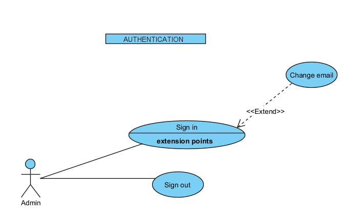
    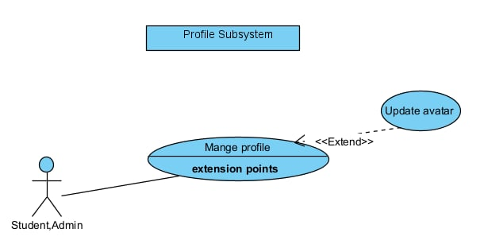
    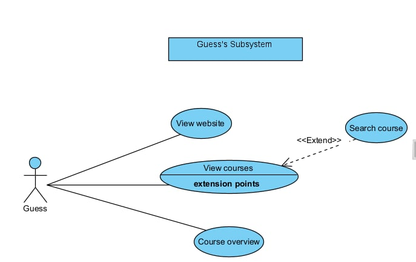
    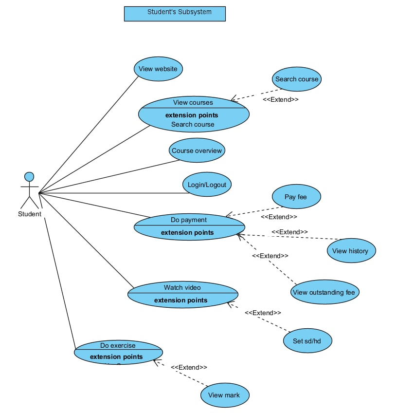
    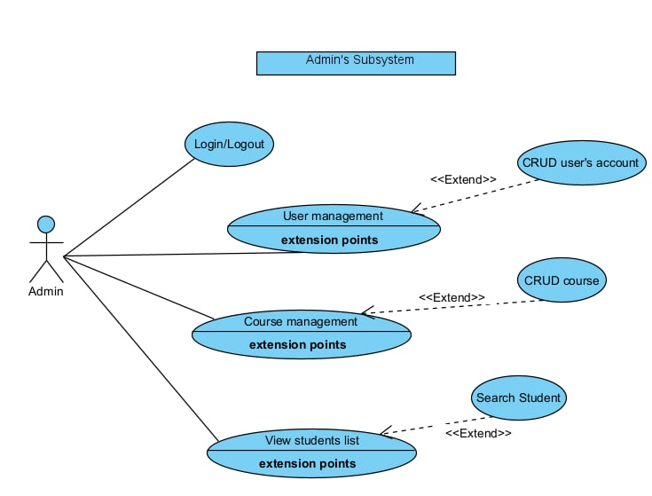

#### 2.2.2. Description

## 3. Functional Requirements
### 3.1. System Functional Overview
#### 3.1.1. Screens Flow

    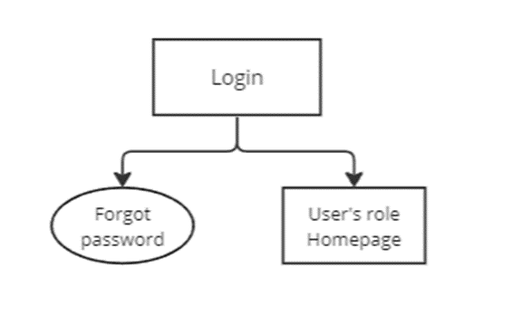

3.1.1.1 Figure 2: Screen flow Diagram - Login

#### 3.1.2. Screen Descriptions
#### 3.1.3. Screen Authorization
#### 3.1.4. Non-Screen Functions
#### 3.1.5. Entity Relationship Diagram
### 3.2. Sign up

|  |  |
| ----- | - |
| **Actor** | Students. |
| **Description** | A page with  form for user to sign up by Gmail. |
| **Pre-conditions** | Pre-1: The user must have Gmail account. |
| **Post-conditions** | POST-1: User registers successfully.   POST-2: User is redirected to Login page.|
| **Basic flow** | 1: Access the website.   2: Click Sign up by Gmail button.  3: Choose Google account to register.   4: Return Login page after signing up sucessfully.|
| **Alternative** | None |
| **Exception** | None |
| | |

| **Item** | **Type** | **Data** | **Description** |
| ----- | - | - | - |
| Sign up | Button | - | Click to sign up account. |
			                   
### 3.3. Sign in
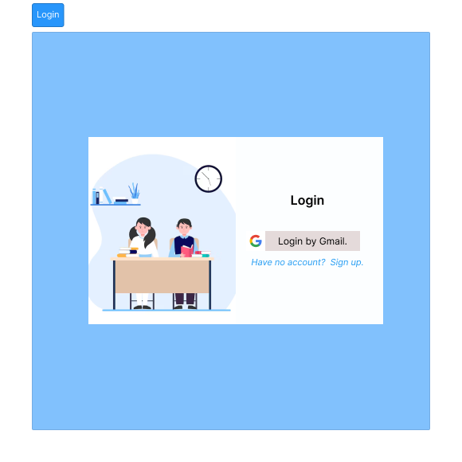
|  |  |
| ----- | - |
| **Actor** | Students, admins. |
| **Description** | A page with  form for user to sign in by Gmail to enter system |
| **Pre-conditions** | Pre-1: User must have Gmail account. |
| **Post-conditions** | POST-1: User logins the system.  POST-2: User will be directed to user's role allowed page or previous page. |
| **Basic flow** | 1: Access the website.   2: Click the Login by Gmail button to login to the website.  3: Choose Google account to sign in the website.  4: Go to previous page or Home page after login sucessfully.|
| **Alternative** | None |
| **Exception** | Login account is invalid:  - System display error message.  Account is not existed:  - System display error message. |
| | |	

| **Item** | **Type** | **Data** | **Description** |
| ----- | - | - | - |
| Login | Button | - | Click to login system. |
### 3.4. Logout

|  |  |
| ----- | - |
| **Actor** | Students, admins. |
| **Description** | A button for user to log out system. |
| **Pre-conditions** | Pre-1: The user logins the website. |
| **Post-conditions** | POST-1: User logouts system successfully. |
| **Basic flow** | 1: Click Log out button in the right of navbar.   2: Return Homepage, in the navbar, avatar image and Logout button disappear, Sign up and Sign in button are displayed.|
| **Alternative** | None |
| **Exception** | None|
| | |

| **Item** | **Type** | **Data**| **Description** |
| ----- | - | - | - |
| Logout | Button | - | Click to logout system. |
### 3.5. View All Courses

|  |  |
| ----- | - |
| **Actor** | Students, admins. |
| **Description** | A page for user to view all courses. |
| **Pre-conditions** | Pre-1: User clicks Course link in the navbar. |
| **Post-conditions** | POST-1: User views all courses in system successfully. |
| **Basic flow** | 1: Click Course link.   2: Redirect to Course page, all courses are displayed.|
| **Alternative** | None |
| **Exception** | No course in system:  - Display icon and waring message: 'No course found'. |
| | |

| **Item** | **Type** | **Data**| **Description** |
| ----- | - | - | - |
| Course avatar | Image | - | Image reperesents course. |
| Course name | Text | - | Show name of course.|
| Description | Text | - | Show short description of course. |
| Total fee | Text | - | Show fee of course. |
| View detail | Button | - | View detail course.|
### 3.6. Search Course

|  |  |
| ----- | - |
| **Actor** | Students, admins. |
| **Description** | A search bar for user to search available course(fuzzy search) . |
| **Pre-conditions** | Pre-1: User is in Course page. |
| **Post-conditions** | POST-1: User searchs courses successfully. |
| **Basic flow** | 1: Fill Course name into the Search bar.   2: Click Search icon or press Enter button.   3: Display all courses found.|
| **Alternative** | None |
| **Exception** | Course can not be found:  - Display icon and waring message: 'No course found'. |
| | |

| **Item** | **Type** | **Data**| **Description** |
| ----- | - | - | - |
| Search bar | Search bar | - | Input data to search. |
| Search icon | Icon | - | Click to search.|

### 3.7. View Detail Course
.png)

|  |  |
| ----- | - |
| **Actor** | Students, admins. |
| **Description** | A page for user to view detail course. |
| **Pre-conditions** | Pre-1: User clicks Detail button of any course link in Course page. |
| **Post-conditions** | POST-1: User views detail information of course successfully. |
| **Basic flow** | 1: Click Detail button.   2: Redirect to Detail Course page, all relate information Course appears.|
| **Alternative** | None |
| **Exception** | None |
| | |

| **Item** | **Type** | **Data**| **Description** |
| ----- | - | - | - |
| Course avatar | Image | - | Image reperesents course. |
| Course name | Text | - | Show name of course.|
| Course infomation | Text | - | Show information of course. |
| Total fee | Text | - | Show fee of course. |
| Buy now | Button | - | Click to buy course.|
| Add to card | Button | - | Click to add course to list. |
| Preview video | Video | - | Click to view preview video about Course. |
| Course introduction | Text | - | Description about Course. |
| Content | Accordion | - | Click to show/hide detail lessons of Content. | 
| Lesson | Link | - | Click to view full lesson video. |
| Preview | Link | - | Click to view preview lesson video. |
### 3.8. View Outstanding Fee/ Payment
.png)

|  |  |
| ----- | - |
| **Actor** | Students, admins. |
| **Description** | A page for user to pay fee of course. |
| **Pre-conditions** | Pre-1: User select course and click button Buy now.   Pre-2: Just display for course have not registered |
| **Post-conditions** | POST-1: Redirect to Payment page.   POST-2: User sees payment information.  POST-3: User can choose payment method and pay. |
| **Basic flow** | 1: Choose only one payment method.   2: Fill payment method information.  Click Pay button.  After payment, Click Back to home page to return Home page.|
| **Alternative** | None |
| **Exception** | Payment account can not be found :  - Show warning popup: 'Account is incorrect. Please check your information.'  - Click Close icon to back to Payment page.   Payment can not complete:  - Show failed popup: 'Payment has error. Please retry.'   -  Click Close icon to back to Payment page.|
| | |

| **Item** | **Type** | **Data**| **Description** |
| ----- | - | - | - |
| Course avatar | Image | - | Image reperesents course. |
| Course name | Text | - | Show name of course.|
| Total fee | Text | - | Show fee of course. |
| Payment method | Radio button | - | Click to choose payment method.|
| Detail payment method | Form | - | Contain payment detail elements. |
| Payment detail| Label| - | Show information need fill.
| Payment detail | Input | - | Input payment method information. |
| Pay | Button | - | Click to pay. |
| Payment successfully| Icon | - | Show payment successfully. |
| Back to home page | Button | - | Click to Home page. |
| Failed | Icon | - | Show failed payment. |
| Failed reason | Text | - | Describe failed reason. |  
| OK | Button | - | Click to return Payment page.|
| Close | Icon | - | Click to close popup. |
### 3.9. View Payment History

|  |  |
| ----- | - |
| **Actor** | Students. |
| **Description** | A page for user to see payment history. |
| **Pre-conditions** | Pre-1: User logins as student and click Payment history link. |
| **Post-conditions** | POST-1: Redirect to Payment history page.   POST-2: User sees payment history information. |
| **Basic flow** | 1: Click payment history link.   2: View payment history.|
| **Alternative** | None |
| **Exception** | No course paid:  - Show table with no data.|
| | |

| **Item** | **Type** | **Data**| **Description** |
| ----- | - | - | - |
|Payment history | Table | - | Show all payment information. |
| Course | Text | - | Show name of course paid. |
| Date | Text | - | Show payment date. |
| Total fee| Text | - | Show total fee paid for course. |
| Payment method | Text | - | Show payment method. |
### 3.10. Update avatar

|  |  |
| ----- | - |
| **Actor** | Students, admins. |
| **Description** | A button for user update avatar. |
| **Pre-conditions** | Pre-1: User logins as student and in Profile page. |
| **Post-conditions** | POST-1: User updates avatar successfully and views new avatar. |
| **Basic flow** | 1: Click Update avatar button.   2: Choose image from folder.   3: Click Ok button.|
| **Alternative** | None |
| **Exception** | None|
| | |

| **Item** | **Type** | **Data**| **Description** |
| ----- | - | - | - |
|Avatar | Image | - | Show user's avatar. |
| Camera | Icon | - | Show update avatar. |
| Update avatar | Button | - | Click to choose new avatar. |

## 4. Non-Functional Requirements
- The user interface should be user-friendly and intuitive, with menus and functionalities logically organised.
- The system should be compatible with popular web browsers such as Chrome, Firefox, Safari, and Edge.
### 4.1 External Interfaces
### 4.2 Quality Attributes
#### 4.2.1 Usability
- The user interface should be easy to understand and use. Common functionalities like logging in, viewing courses, paying fees, etc., should be easily accessible.
- The system should have a consistent look and feel across all its pages.
#### 4.2.2 Reliability
- The system should be able to recover from failures without losing data.
- The system should perform consistently under normal conditions.
#### 4.2.3 Performance
- The system should load quickly and respond to user actions without delay.
- The system can serve 100 - 200 users at the same time without performance degradation.
#### 4.2.4 Availability	
- The system should be available for use 24/7, barring scheduled maintenance periods.
- The system should have a high uptime, with minimal outages or downtime.
#### 4.2.5 Security	
- The system should ensure the confidentiality, integrity, and availability of user data.
- The system should authenticate users by Google authentication before granting access to features.
- The system should authorise users based on their roles (student, guess, admin) and restrict access accordingly.

